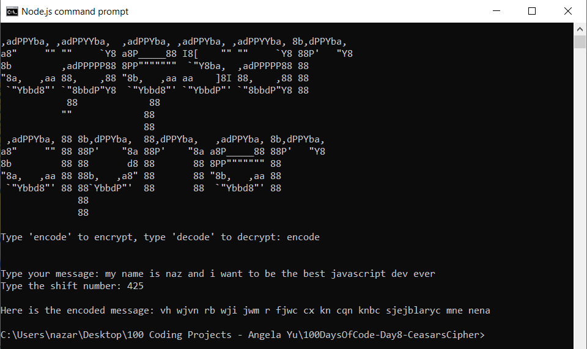

# 100 Days of Code - Day 8 - Ceassars Cipher

# Prompt

Create a program that has the following console features:

* display "Caesar Cipher" in ASCII Art
* the user can choose to either encode or decode a message
* if encode, the user will input a message
* then, then user will be asked how many letters to offset by
* return to the user, an encoded message.
* if decode, ask the user for a message.
* then ask the user how much to offset the letters by
* return to the user, the decoded message

* Example

CAESAR

CIPHER

Type 'encode' to encrypt, type 'decode to decrypt': encode

Type your message: hello coders

Type the shift number: 9

Here is the encoded message: qnuux lxmnbc

------------------------------------------------------------------

CAESAR

CIPHER

Type 'encode' to encrypt, type 'decode to decrypt': decode

Type your message: qnuux lxmnbc

Type the shift number: 9

Here is the decoded message: hello coders

# Screenshot of Working Solution

------------------------------------------------------------------

